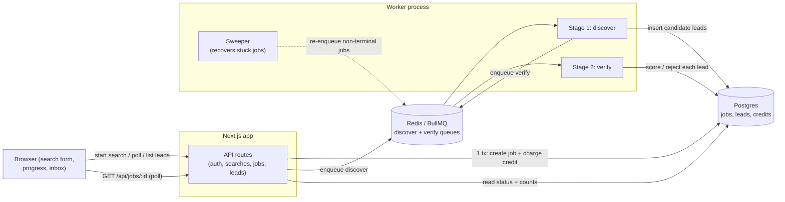

# Lead Discovery Pipeline

A small multi-tenant lead tool. A user submits who they want to find, the system runs a
two-stage background job (**discover → verify**), and the results land in an inbox they can
review. Each organization only ever sees its own jobs and leads.

> **Live demo:** https://gecko.marzallan.com, sign in with `marz@test.com` (passwordless).

---

## What it does

- Sign in as a demo user and pick a workspace (organization).
- Start a search (companies, roles, region). This costs **1 credit** and returns a `job_id`
  immediately (**HTTP 202**); the pipeline runs in the background.
- A background worker finds candidate leads, then verifies each one (approve or reject).
- Watch the job progress live with an activity log, **cancel** an in-flight job, then browse the
  leads in an inbox and filter by status.

---

## Tech stack

| Area       | Choice                                           |
| ---------- | ------------------------------------------------ |
| Framework  | Next.js 15 (App Router) + React 19               |
| Language   | TypeScript (frontend + backend)                  |
| Database   | Postgres, via Drizzle ORM                        |
| Queue      | Redis + BullMQ (two queues: discover, verify)    |
| Validation | Zod, one shared contract for API + worker + UI   |
| Logging    | Pino (structured JSON logs)                      |
| Tests      | Vitest (68 tests)                                |
| Dev mock   | MSW for the frontend (off by default)            |
| Tooling    | ESLint, Prettier, Husky, commitlint, drizzle-kit |

---

## Architecture

The web app and the worker are two separate processes. They only talk through Postgres
(the source of truth) and Redis (the job queue). The HTTP request never runs provider work;
it just creates the job, charges the credit, and enqueues stage one.



**Job states:** `queued → discovering → verifying → completed` (or `failed`). A user can
**cancel** an in-flight job from the UI (any non-terminal state → `cancelled`).

**Lead states:** `unverified_raw` → `verified` or `rejected` (with a `rejection_reason`).

---

## Walkthrough: one search, end to end

What happens after a user clicks **Start search**:

1. **Submit.** Signed in as `marz@test.com`, workspace Marz Labs, the user enters companies, roles,
   and region, then submits. The form disables and sends an `Idempotency-Key`.
2. **Charge + create (sync).** `POST /api/searches` runs **one transaction**: create the job
   (`queued`), charge 1 credit, write a ledger row. It returns the `job_id` with **HTTP 202** right
   away — no provider work in the request.
3. **Enqueue + poll.** The API enqueues the **discover** job on Redis/BullMQ. The UI starts polling
   `GET /api/jobs/:id` every ~1.5s and shows the live stage + counts.
4. **Discover (worker).** Job → `discovering`. The mock provider generates candidates (deterministic
   from `job_id`), inserts them `ON CONFLICT DO NOTHING`, records the discovered count, then hands
   off: job → `verifying`, enqueue **verify**.
5. **Verify (worker).** Each candidate is scored — junk emails (`info@`, `noreply@`) → `rejected`
   with a reason, the rest → `verified` with a 0-100 score. Counts are saved, job → `completed`.
6. **Done.** The next poll sees `completed`, stops polling, refreshes the credit pill, and shows the
   summary. The user opens the **inbox**, filters verified / rejected, and sees each lead's score or
   rejection reason.

**Other paths:**

- **No credits** → the transaction rolls back, **402**, the form shows an error, no job created.
- **Rate limit** → a 4th start within 10s → **429** + a live cooldown, checked _before_ the charge
  so nothing is spent.
- **Cancel** → any non-terminal job → `cancelled`, the charged credit is **refunded**, and the
  worker stops at its next guarded step.
- **0 candidates** (`__empty__`) → job still `completed`, empty inbox.
- **Provider error** (`__fail__`) → job `failed`, the UI shows the stored error.
- **Worker crash after discover** → on restart the stage re-runs with **no duplicate leads** (see
  [Idempotency & recovery](#idempotency--recovery)).

---

## Core MVP features

- **Multi-tenant.** Every job, lead, and credit row carries an `organization_id`. The org is
  read only from the session, never from the request body, so one org can't reach another
  org's data. A cross-org `job_id` returns **404**, not the row; leads are only ever listed
  org-scoped, so another org's leads never appear in the inbox.
- **Credits.** Each search costs 1 credit. The credit charge and the job creation happen in a
  **single database transaction**, so a failed charge rolls the whole thing back. Double-clicking
  submit spends only 1 credit (idempotency key + unique constraint).
- **Two real stages.** Discover and verify are separate BullMQ queues handled by a separate
  worker. Verification does **not** run inside the HTTP handler.
- **Inbox.** Leads are listed per org and can be filtered by status.
- **Idempotent + restart-safe.** Re-running a job (or a worker crash after discover) never
  duplicates leads. See [Idempotency & recovery](#idempotency--recovery).
- **Errors surface.** A failed job stores its error and the UI shows it.
- **Cancel.** An in-flight job can be cancelled from the UI. Status advances are conditional
  updates (`WHERE status = <from>`), so the worker never clobbers a cancel; it also checks for
  cancellation during its stage pause, so the pipeline stops cleanly mid-run.
- **Activity log.** Every job keeps a per-run timeline (`queued`, `discovering`, `discovered N`,
  `verifying`, `completed`, plus `crashed` / `recovered` / `retry` / `cancelled`), appended by the
  backend (worker for the stage events, API for `queued` / `cancelled`) and shown live under the
  progress card. A crash + recovery shows as two discovery passes.
- **Explainable scoring (extra).** A verified lead gets a 0-100 score built from named factors
  (title seniority, corporate domain, named mailbox, etc.), not a black-box number.
- **Rate limit (extra).** Start-search is capped per org (default **3 per 10s**, a Redis
  fixed-window). Over the cap the API returns **429** with a `Retry-After`, and the UI shows a live
  cooldown. The check runs **before** the credit charge, so a blocked burst never spends credits.

---

## Mock data & providers

Real SERP/email APIs are swapped out for mocks that behave like the real thing but need no keys.
Both sit behind interfaces (`DiscoverProvider`, `VerifyProvider`) so a real provider can drop in
later; see [Plugging in a real provider](#plugging-in-a-real-provider).

**Mock discover** (`src/core/providers/mock-discover.ts`)

- Deterministic: seeded by `job_id`, so the same job always produces the same candidates. This is
  what makes runs testable and re-runs safe.
- Produces 3-5 contacts per company with varied names; titles cycle through the roles you searched.
  Capped at 50 candidates per job (the brief's 0-50 range).
- Always includes at least one **junk email** per company (`info@…` or `noreply@…`) so the verify
  step has something to reject.
- Two test sentinels you can type as a company name:
  - `__empty__` → returns 0 candidates (job still completes, empty inbox).
  - `__fail__` → throws, so you can see the **failed** job path in the UI.

**Mock verify** (`src/core/providers/mock-verify.ts`)

- Rejects any email containing `noreply` or starting with `info@`, with a reason.
- Otherwise approves and returns a 0-100 score plus the factors that make it up.

**Seed data** (`npm run seed`, `scripts/seed.ts`): 2 orgs, 2 users, different credit balances:

| User             | Password | Workspaces (orgs)           | Credits            |
| ---------------- | -------- | --------------------------- | ------------------ |
| `marz@test.com`  | none     | Marz Labs                   | Marz Labs = **10** |
| `allan@test.com` | none     | Marz Labs **and** Allan Inc | Allan Inc = **1**  |

Login is passwordless (email only); this is a demo. Allan Inc starts with 1 credit so you can
hit the "no credits" path quickly. Allan belongs to two orgs, which lets you test the workspace
switcher and prove isolation.

---

## Run it locally

### Fastest — one command (only Docker needed)

```bash
docker compose -f docker-compose.prod.yml up --build
```

Builds the image once, then runs Postgres + Redis + migrate/seed + app + worker + Caddy. Open
**http://localhost** and sign in with `marz@test.com`.

### Dev setup (Node on the host, hot reload)

**Requirements:** Node 20+ and Docker.

```bash
# 1. Environment
cp .env.example .env

# 2. Start Postgres + Redis
docker compose up -d postgres redis

# 3. Install, migrate, seed
npm install
npm run migrate
npm run seed

# 4. Run the app and the worker in two terminals
npm run dev      # terminal 1  -> http://localhost:3000
npm run worker   # terminal 2
```

Then open http://localhost:3000 and sign in with `marz@test.com`. Start a search (e.g. companies
`Marriott`, role `Director of Sales`, region `Malaysia`) and watch it move through discover →
verify. To see the **per-org rate limit**, click **Start search** four times quickly — the fourth
returns 429 and the form shows a cooldown (default 3 per 10s).

> The base `docker-compose.yml` only runs Postgres + Redis for local dev. The full stack
> (app + worker + Caddy) lives in `docker-compose.prod.yml`, served on port 80.

### Commands

| Command             | What it does                                       |
| ------------------- | -------------------------------------------------- |
| `npm run dev`       | Start the Next.js app                              |
| `npm run worker`    | Start the background worker (discover + verify)    |
| `npm run migrate`   | Apply database migrations                          |
| `npm run seed`      | Create the demo orgs, users, and credits           |
| `npm test`          | Run all tests (needs Postgres + Redis up)          |
| `npm run test:ui`   | Run only the pure/frontend tests (no infra needed) |
| `npm run typecheck` | Type-check with `tsc`                              |
| `npm run lint`      | Lint with ESLint                                   |

---

## Tests

```bash
npm test        # all 68 tests (backend tests need Postgres + Redis running)
npm run test:ui # pure logic + frontend only, no database
```

They cover the parts most likely to break: atomic credit charge, double-submit, cross-org
isolation, the discover/verify state machine, crash-and-restart with no duplicate leads, cancel
(including cancel mid-stage without clobbering it), the activity-log event sequence, the per-org
rate limit, mock providers, and the scoring logic.

---

## How the parts work

### Multi-tenancy

The active organization lives on the **session row**, not in the request. Every API route reads
`orgId` from the session and passes it into the database query, and every tenant query filters on
`organization_id`. There is no way to send an org id from the client. Membership is also
re-checked on every request, so access revoked mid-session stops right away instead of lasting
until the cookie expires.

### Credits

`startSearch` runs one Postgres transaction that:

1. Inserts the job with a `UNIQUE(org, idempotency_key)` constraint, so a double-click collapses
   to one job.
2. Charges the credit with `UPDATE … SET credits = credits - 1 WHERE credits >= 1`. If no row is
   updated (no credits), the whole transaction rolls back → HTTP 402.
3. Writes a credit-ledger row.

Because it's one transaction, the charge and the job are always consistent: you never get a job
without a charge, or a charge without a job.

### Idempotency & recovery

Scenarios:

1. **The same job runs twice.** I put a unique key on every lead (`UNIQUE(job_id, candidate_key)`)
   and insert with "skip if it already exists," so a re-run of discovery re-inserts the same rows,
   they all get skipped, so never can end up with duplicate leads.

2. **The worker crashes mid-job.** I make discovery safe to repeat, so recovery is just "run it
   again." Try it: set `CRASH_AFTER_DISCOVER=1` and start a search — the worker saves the leads, then
   dies before verifying. On restart it sees the job still `discovering`, re-runs discovery (the
   duplicates get skipped), and carries on to verify. Nothing lost, nothing doubled.

3. **A job is created but never queued.** I run a small custom **sweeper** on startup and every 10s that
   finds in-progress jobs with no queued work and re-queues them at the right stage. The queue id is
   fixed per job, so re-queuing one that's already there does nothing — a dropped hand-off heals
   itself instead of hanging forever.

### Plugging in a real provider

The pipeline only depends on two interfaces (`src/core/providers/types.ts`):

```ts
interface DiscoverProvider {
  discover(input: SearchRequest, jobId: string): Promise<CandidateLead[]>;
}
interface VerifyProvider {
  verify(candidate: CandidateLead): Promise<VerifyResult>;
}
```

If i were to plug in real ones:

1. **Discovery Stage** - implement `createRealDiscoverProvider` against a SERP API (**DataForSEO**). Call the API, then
   map each search hit to a `CandidateLead` with a **stable** `candidateKey`.
   - Worked with DataForSeo before and can vouch for their results from the scraped data.
   - **OR** implement own serp Scraper (at a scale can be good to self-implement since break even at the cost of infra), Stack I'd use is Playwright, potentially cheerio as fallback. Selenium if the site trying to scrape have heavy bot blocking mechanism

2. **Verification Stage** — implement `createRealVerifyProvider` against an email-verification API (**Hunter**): return `ok`, plus a `reason` on reject and a `score` on approve.

---

## Environment variables

| Variable                | Default        | What it's for                                                                    |
| ----------------------- | -------------- | -------------------------------------------------------------------------------- |
| `DATABASE_URL`          | local Postgres | Postgres connection string                                                       |
| `REDIS_URL`             | local Redis    | Redis connection string                                                          |
| `POSTGRES_PORT`         | `5432`         | Host port for the Postgres container                                             |
| `REDIS_PORT`            | `6379`         | Host port for the Redis container                                                |
| `SESSION_SECRET`        | _(required)_   | Signs the session cookie; min 16 chars, no code default; set a long random value |
| `PROVIDER_MODE`         | `mock`         | `mock` or `real`                                                                 |
| `WORKER_CONCURRENCY`    | `5`            | Jobs processed at once per stage                                                 |
| `RATE_LIMIT_MAX`        | `3`            | Max start-search calls per org per window (`0` disables)                         |
| `RATE_LIMIT_WINDOW_MS`  | `10000`        | Rate-limit window in ms                                                          |
| `STAGE_DELAY_MS`        | `0`            | Pause per stage (ms); `.env` sets `2000` so progress and cancel are watchable    |
| `QUEUE_PREFIX`          | `bull`         | BullMQ key prefix (tests use a separate prefix so a dev worker can't race them)  |
| `CRASH_AFTER_DISCOVER`  | `0`            | Set to `1` to demo crash recovery                                                |
| `NEXT_PUBLIC_USE_MOCKS` | `false`        | Use the MSW frontend mock instead of real API                                    |
| `NODE_ENV`              | `development`  | `development` / `test` / `production`                                            |

---

## Production next steps

Out of scope for the take-home; what I'd actually do for a real deployment.

**Deploy.** What prod runs today:

- push to `main` → build the image → ship it to the box → recreate the stack
- runtime config (stage delay, rate limit) rides a version-controlled compose overlay, so it can't drift

Next:

1. **Blue-green on the box** — two compose stacks behind Caddy: bring the new one up, health-check,
   flip, keep the old one warm for a one-command rollback. Removes today's recreate-the-stack
   downtime; safe because the worker drains on SIGTERM and inserts are idempotent. Needs
   backward-compatible migrations (add first, drop later) since both share the DB. <- Love this method. Simple. Slightly heavier on the server
   - **Result: zero downtime + instant rollback**

2. **Switch DB and Redis** to managed services (RDS / ElastiCache) — because currently a single-VM
   database is the weak point, and managed storage brings backups, failover, and
   point-in-time recovery, but this also can be implemented at a scale to cut cost.
   - **Result: resilience (backups, failover, PITR)**

3. **Split the worker out and autoscale on queue depth** (spot instances) when one box can't keep
   up. The web tier barely grows — polling stops at a terminal state — and a killed job just
   re-runs cleanly.
   - **Result = Throughput (Horizontal Scaling)**

4. **Kubernetes** I think its overkill (expensive on cash and costly on time) at current stage, probably when it grows into enough services to justify it; ECS/Fargate or Nomad covers
   one app + one worker for a long time.
   - **Result = (All in one, Scaling)**
